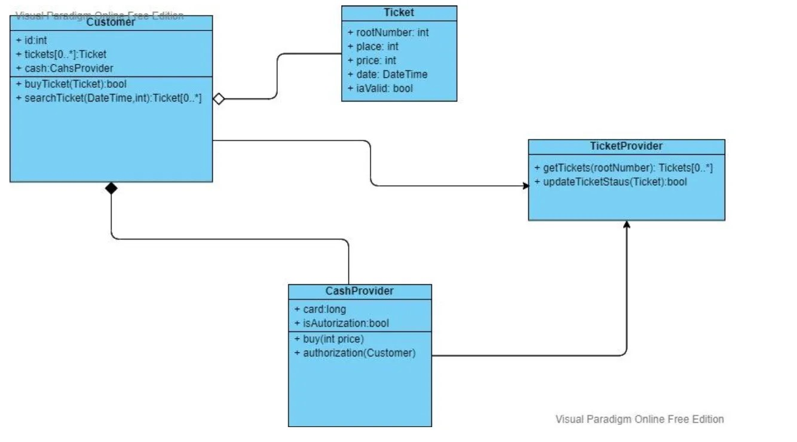
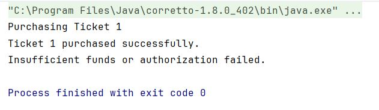

# Архитектура ПО
### Урок 4. Принципы SOLID

## ЗАДАНИЕ:
Примерная схема UML диаграммы сервиса покупки билетов:

 

**Задание 1**. На основе UML диаграммы, разработанной на семинаре, написать код JAVA. 
При разработке методов использовать контрактное программирование.

## РЕШЕНИЕ:

1. Код

[Main.java](src/Main.java)

2. Диаграмма UML

 
